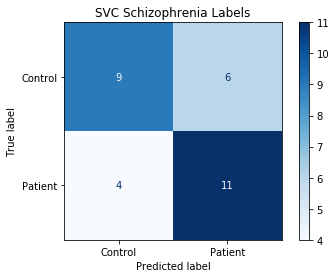

# Predicting Schizophrenia Diagnosis from Resting State fMRI

Team contributors: Alex(ander) Albury

## Summary 

This repo contains a project conducted for Brainhack School 2020

I'm a Psychology student at Concordia researching music cognition. I'm interested in data science and programming. I am primarily an R user and before this project I was comfortable with the basics of Python programming. This project uses a variety of tools to import visualize and analyze fmri data.

## Project definition 

### Background

This project will apply machine learning to predict schizophrenia diagnosis using fMRI data.

The data used is a resting state fMRI dataset of schizophrenia patients and healthy controls. The data comes from [The Center for Biomedical Research Excellence (COBRE)](http://fcon_1000.projects.nitrc.org/indi/retro/cobre.html).

This project aims to predict schizophrenia diagnosis using resting state data. Machine learning techniques will be used to classify schizophrenia patients from controls. The COBRE data set also includes subtypes of schizophrenia and so this project will predict diagnosis amonng schizophrenia patients. My goal for this project is to gain basic experience with processing/cleaning fMRI data. Following this, I'd like to experiment with different machine learning methods (algorithms, corss-validation methods, hyperparamters) and see how they compare.

### Tools 

The project will rely on the following technologies: 
 * This README is built using [Markdown](https://guides.github.com/features/mastering-markdown/), to structure the text.
 * Processing of fMRI data is done with `nilearn` and the machine learning anlayses rely on `scikit-learn`.
 * `plotly.express` and `ipywidgets` are used to create interactive visualizations.
 * The main summary and results of the project will live in a [Jupyter Notebook](https://jupyter.org/index.html) 
 * Updating and version control relies on github, through commits and pull requests.

### Data 

The preprocessed data is publicly available on Nilearn and can be downloaded using `nilearn.datasets.fetch_cobre()` Documentation about the Nilearn data can be found [here](https://nilearn.github.io/modules/generated/nilearn.datasets.fetch_cobre.html#nilearn.datasets.fetch_cobre). (**Note**: The Nilearn implementation of this dataset is deprecated and so access to the data may change or be removed.)

### Deliverables

Products of this project include:
 - A complete README summarizing the entire project and its results.
 - Week 3 Deliverable: 
     - [Plotly Histogram](http://htmlpreview.github.io/?https://github.com/brainhack-school2020/Alex-A14_Brainhack2020/blob/master/plotly.html)
     - Binder With ipywidgets Correlation Matrices 
 - A [Jupyter notebook](https://github.com/brainhack-school2020/Alex-A14_Brainhack2020/blob/master/analysis.ipynb) that contains all of the relevant code for the project, clearly formatted and commented.
 - A formatted [html document](http://htmlpreview.github.io/?https://github.com/brainhack-school2020/Alex-A14_Brainhack2020/blob/master/analysis.html) that contains code, descriptions, and visualizations from the project.

## Results 

### Overview

The project involved importing and cleaning the demographic data and nifiti files. After this, time series and correlation matrices were generated for each subject. Visualizations of subject demogrpahics and connectivity matrices of patients and controls were generated. Finally, various machine learning models were trained to predict schizophrenia diagnosis and were evaluated using 10-fold cross validation. The performance of the best performing model was then evaluated using a validation set.

### Tools learned in this project:

 * **fMRI Data Processing with Nilearn**
 * **Machine Learning with Scikit Learn**
 * **Interactive plotting with Plotly Express**
 * **Pandas Data Manipulation**
 * **fMRI Data Visualization**
 * **Visualizing Machine Learning Metrics**

### Method

#### Data Cleaning

Data preparation involved extracting subject ID from the nifti file paths and then using this to merge the final names to the phenotypic data. This allowed for easy subsetting when creating data visualizations comparing patients and controls. The final step in data visualization was to generate time series and correlation matrices for each subject. The correlation matrices were then merged to the phenotypic data to create a column of containing the correlation matrix for each subject.

#### Data Visualization

Feature plots were genrated showing average actiation for patients and controls. An [interactive Plotly Express app](http://htmlpreview.github.io/?https://github.com/brainhack-school2020/Alex-A14_Brainhack2020/blob/master/plotly.html) was generated to display a histogram of age for patients and controls. Lastly, interactive visualizations were created to display average correlation matrices for patients and controls.

#### Classification

The primary goal of the project was to predict schizophrenia diagnosis. Several machine learning apporaches were evaluated on the data. The data was split into training and validation sets using an 80/20 split. Each model was then evaluated on the training data using 10-fold cross validation. F1 score was used as a performance metric. In some cases, a grid search was used to optimize hyperparameters.
 
### Results

The table below displays the average performance of each model across the 10-folds.

| Classifier      | Average CV F1 | Min  | Max  |
| --------------- | ------------- | ---- | ---- |
| Linear SVC      | 0.80          | 0.63 | 1.0  |
| Gradient Boost  | 0.58          | 0.24 | 0.83 |
| KNN             | 0.62          | 0.43 | 0.73 |
| Random Forest   | 0.73          | 0.58 | 0.92 |
| RBF SVC (Tuned) | 0.81          | 0.63 | 1.0  |

The best performing model was Support Vector Machine CLassifier (SVC) using an RBF kernel, with values of 100.0 and 0.001 for the `C` and `gamma` parameters, respectively. This model was then used to predict daignosis on the left out validation set. On the validation set, the model had a final F1 score of **0.69**, and an accuracy of **0.67**.

The figure below shows a confusion matrix of the model's predictions:

 
### Discussion and Limitations

An F1 of .69, and accuracy of 67% isn't bad for a binary classfication problem, especially considering the small sample size. It's possible that better performance could be achieved through several methods. This analysis uses 64 ROIs but the atlas used supports up to 444. Increasing the number fo features could improve the model. Conversely, dimensionality reduction could be used to reduce the number of features available to the model.

Hyperparameter tuning of more advanced models could be another avenue for improved performance. The Random Forest classifier showed potential, and more time spent tweaking this model could produce better results.

Finally, this analysis doesn't examine feature importance. It's likely that an analysis of a similar size or greater could be devoted to investigating feature importance for schizophrenia prediction, and so it was far beyond the scope of this project.

## Conclusion and Acknowledgements

This project has been a great introduction to working with fMRI data, and using Scikit Learn. The range of functions and clear documentation for both of these packages make them accessible and easy to learn. The project has also strengthened my skills in Python, particularly data management with Pandas.

Apart from the main project, participating in Brainhack 2020 has had several benefits. I am more comfortable with shell coding and the introduction to WSL makes it easier for me to work in Linux environments. The focus on reproducible science has introduced me to numerous tools for making analyses accessible, from Git to Docker. I am also looking forward to trying more tools for neuroimaging analysis, inlcuding fMRIPrep for preprocessing, and MNE (Python) and EEG Workshop (R) for processing EEG data. Although I've only had a brief introduction to many of these tools I feel like they are accessible with the experience that Brainhack has given me.

I'd like to thank all of the instructors, presenters, TAs, and mentors who helped make Brainhack 2020 a success (in a new online format!). I look forward to seeing what Brainhack does in the future.
